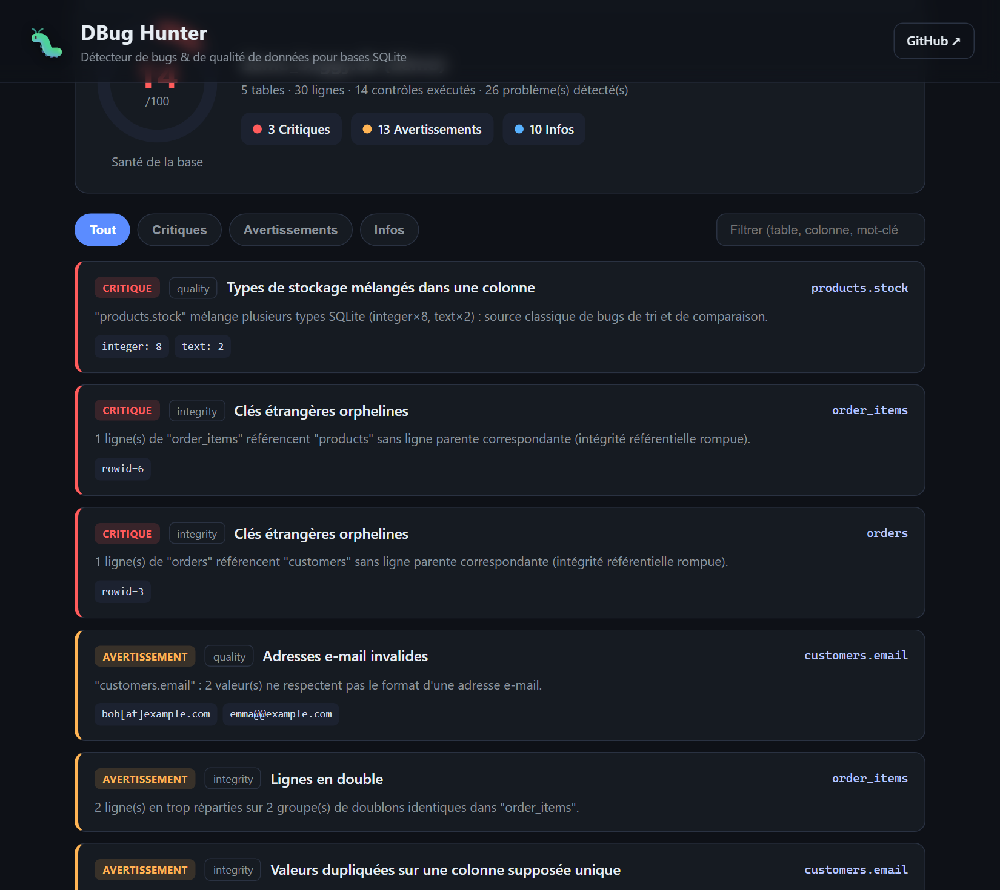

# 🐛 DBug Hunter

> Détecteur de bugs et de qualité de données pour bases **SQLite** — déposez une base, obtenez un rapport des problèmes classés par gravité.

[](https://louey9999-dbug-hunter.hf.space)


**🔗 Démo en ligne : https://louey9999-dbug-hunter.hf.space**

DBug Hunter est une petite **application web en Python** qui inspecte une base de
données SQLite et débusque les bugs courants : intégrité référentielle rompue,
doublons, types incohérents, dates invalides, valeurs aberrantes, problèmes de
schéma… le tout résumé par un **score de santé** sur 100.



---

## ✨ Fonctionnalités

- **Glisser-déposer** d'un fichier `.sqlite` / `.db` directement dans le navigateur.
- **Base de démonstration** intégrée pour tester l'outil en un clic.
- **14 contrôles** répartis en 4 familles, avec gravité (critique / avertissement / info).
- **Score de santé** 0–100 et tableau de bord filtrable (par gravité, recherche plein texte).
- Moteur de détection **découplé de l'interface** → réutilisable en CLI ou en bibliothèque.
- **Aucune donnée conservée** : les fichiers envoyés sont analysés puis supprimés.

## 🔎 Les bugs détectés

| Famille | Contrôle | Gravité |
|---|---|---|
| **Intégrité** | Clés étrangères orphelines (référence un parent inexistant) | 🔴 critique |
| **Intégrité** | Lignes strictement dupliquées | 🟠 avertissement |
| **Intégrité** | Valeurs en double sur une colonne supposée unique (email, sku…) | 🟠 avertissement |
| **Qualité** | Types de stockage mélangés dans une même colonne | 🔴 critique |
| **Qualité** | Adresses e-mail invalides | 🟠 avertissement |
| **Qualité** | Dates invalides / dans le futur | 🟠 / 🔵 |
| **Qualité** | Valeurs négatives sur une colonne « positive » (prix, quantité…) | 🟠 avertissement |
| **Qualité** | Valeurs manquantes (NULL) | 🟠 / 🔵 |
| **Qualité** | Espaces superflus, chaînes vides | 🔵 info |
| **Qualité** | Valeurs aberrantes (méthode de l'IQR) | 🔵 info |
| **Schéma** | Table sans clé primaire | 🟠 avertissement |
| **Schéma** | Table vide | 🔵 info |
| **Performance** | Clé étrangère sans index | 🟠 avertissement |

## 🚀 Démarrage rapide

```bash
git clone https://github.com/baluva/dbug-hunter.git
cd dbug-hunter

python -m venv .venv
# Windows :
.venv\Scripts\activate
# macOS / Linux :
source .venv/bin/activate

pip install -r requirements.txt

# (1) Générer la base de démonstration buggée
python scripts/make_demo_db.py

# (2) Lancer l'application web
python run.py            # ouvre http://127.0.0.1:8000
```

Puis cliquez sur **« Scanner la base de démo »**, ou glissez votre propre fichier SQLite.

## 🧩 Utilisation en bibliothèque

Le moteur s'utilise aussi sans interface :

```python
from dbughunter import scan_database

report = scan_database("ma_base.sqlite")
print(report["summary"]["score"])          # 0–100
for f in report["findings"]:
    print(f["severity"], f["table"], f["title"])
```

## 🌐 API

| Méthode | Route | Description |
|---|---|---|
| `GET`  | `/` | Interface web (page unique) |
| `POST` | `/api/scan` | Envoi d'un fichier SQLite (`multipart/form-data`), renvoie le rapport JSON |
| `GET`  | `/api/demo` | Analyse la base de démonstration |
| `GET`  | `/api/health` | Sonde de disponibilité |

Documentation interactive auto-générée sur `/docs` (Swagger UI fourni par FastAPI).

## 🏗️ Architecture

```
dbug-hunter/
├── dbughunter/
│   ├── models.py      # introspection SQLite + dataclasses (Finding, TableInfo…)
│   ├── checks.py      # catalogue des détecteurs (1 fonction = 1 contrôle)
│   ├── detector.py    # orchestration des contrôles + calcul du score
│   └── webapp.py      # API FastAPI
├── web/               # interface (HTML / CSS / JS sans build)
├── scripts/
│   └── make_demo_db.py
├── tests/             # tests pytest des détecteurs
└── data/
    └── demo_buggy.db  # base de démonstration générée
```

Ajouter un nouveau contrôle = écrire une fonction `check_xxx(db) -> list[Finding]`
dans `checks.py` et l'ajouter à la liste `CHECKS`. Le reste (UI, score, API) suit
automatiquement.

## ✅ Tests

```bash
pytest -q
```

## 🛠️ Stack technique

- **Python 3.10+**, **FastAPI** + **Uvicorn** côté serveur
- **SQLite** via les `PRAGMA` natifs (`foreign_key_check`, `table_info`…)
- Interface **vanilla** HTML/CSS/JS (aucun bundler, aucune dépendance front)
- Tests avec **pytest**

## 📄 Licence

MIT — voir [LICENSE](LICENSE).

---

Réalisé par **[Louey Barbirou](https://github.com/baluva)**.
